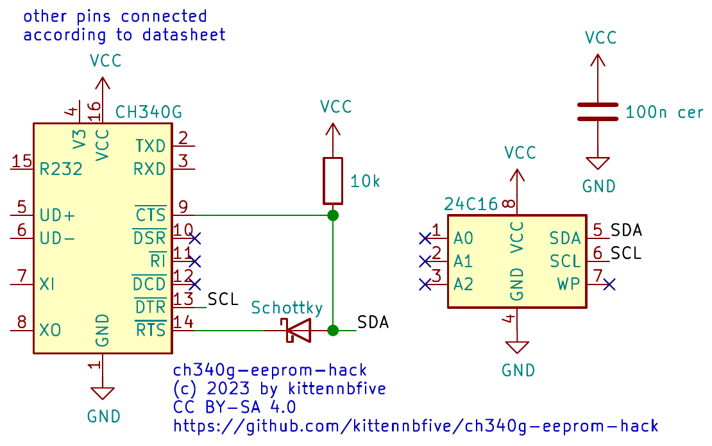

# ch340g-eeprom-hack

## What is this?
This repo shows how to add an unique identifier (ASCII-string) to the cheap CH340G USB-to-UART modules. It contains informations about the needed hardware-hacking and a hacked driver for Linux.

## Wait a sec, the CH340G does not have an EEPROM interface!?
Indeed, but it has status pins that can be repurposed/abused to bitbang I2C from inside the driver.

## This is nasty!
Yes, definitively. It is intended as a proof of concept only. You probably should just use USB-to-UART modules that have a "builtin" unique serial number. The Linux-Kernel is a **really** complex animal and i have basically no idea what i am doing \[insert meme here\]...

## Why???
Well, i had some CH340G modules in use and needed a way to distinguish them when plugged into random USB ports. I knew about those status pins because i [used them as GPIO](https://github.com/kittennbfive/CH340G-GPIO-mod) already, the Linux driver is open-source (Thanks to all the developpers!) and i had an old 24C16 (I2C-EEPROM) lying around, so i thought "Would it be possible?" and got carried away...  
Also while there are other modules like PL2303 or FT232H, they are more expensive and/or the IC have smaller packages that makes it more difficult to add an EEPROM. The CH340G on the other hand comes in a handy SO-package with 1,27mm spacing (opposed to 0,5mm on the PL2303 e.g.).

## Licence(s) and Disclaimer
The modified driver is under the GPLv2 as the original.   
The tool for writing/reading the EEPROM using libusb is under AGPLv3+.  
The pictures (todo), schematic and text are provided under Creative Commons CC BY-SA 4.0.  
As usual the content of this repo is provided WITHOUT ANY WARRANTY! USE AT YOUR OWN RISK! It is really, *really* experimental stuff. Messing with Kernel-modules involves risks like crashes or worse. If you want to test this code do it inside a VM with USB-passthrough or at least **not** on a production machine please!

## The hardware
### Schematic
You need an 24Cxx (currently the code is written for 24C16, i don't know if smaller/bigger EEPROM will work out of the box as i am still waiting for my order and didn't look at the datasheets carefully), a 100nF ceramic capacitor for the EEPROM, a pull-up resistor (something like 3k-10k should be fine) and a *shottky*-diode (like BAT54).



*Picture(s) may follow once i received my order.*

### Content of the EEPROM
Really simple, starting at address 0x0000:
- 2 bytes signature to identify the EEPROM: ASCII 'C', 'H'
- identifier as null-padded ASCII-string. Maximum length is adjustable by `#define` in the driver, currently set to 8 caracters.
- (don't care for the remaining space in EEPROM)

## The software

### The hacked driver
The original driver was borrowed from Kernel 6.1.7. The file is `linux-6.1.7/drivers/usb/serial/ch341.c`. I have no clue if this code can be compiled for 5.x or an even older Kernel.

#### How to compile?
You need some dependencies like GCC (obviously), make, the Kernel-headers and maybe other stuff. Look on the internet... Once all this is ready just `cd` into the directory of `ch341_eeprom.c` and `Makefile` (it's a single line but *needed*!) and run ```make -C /lib/modules/`uname -r`/build M=$PWD```. Compiling takes only a few seconds and will give you a Kernel-module called `ch341_eeprom.ko` in the same directory.

### How to use?
You will need superuser-priviledges to continue.

#### udev rules
Create a file `/etc/udev/rules.d/99-serial.rules`
```
ACTION=="add", SUBSYSTEM=="tty", ENV{ID_VENDOR_ID}=="1a86", ENV{ID_MODEL_ID}=="7523", ATTRS{identifier}=="$chosen_identifier", SYMLINK+="$wanted_symlink"
[same thing with different identifier and symlink for next device, as often as you need]
```
and then tell udev to reload everything: `udevadm control --reload`. The identifier must be an ASCII-string, currently its length is set to *8 characters maximum*.

#### Loading the driver (non-persistent)
First you may have to unload the original driver by doing `modprobe -r ch341`. Then you can simply use `insmod ch341_eeprom.ko` from inside the correct directory. If you get an error about missing symbols load `usbserial` first by executing ```insmod /lib/modules/`uname -r`/kernel/drivers/usb/serial/usbserial.ko```. To remove the module do `rmmod ch341_eeprom.ko`.

#### Loading the driver (persistent)
Do you really want to use this hack? If so it probably involves blacklisting the original driver and *somehow* adding the new, hacked driver *somewhere*... I have to do some research... Stay tuned.

### Reading/Writing the EEPROM
I made a small tool that uses libusb-1.0. It is called `ch340g_eeprom` and needs to be run as root because of permissions. Tested on Debian 11.

#### Compiling
As simple as `./make`, assuming you have `libusb-1.0-0-dev` (name of the package on Debian 11) installed.

#### Usage
```
This is ch340g_eeprom version 0.1 (c) 2023 by kittennbfive

THIS TOOL IS PROVIDED WITHOUT ANY WARRANTY!

WARNING: Only connect a single CH340G to your PC when using this tool!

usage: ch340g_eeprom $command [$identifier]

$command:
	--help: Print this text and exit
	--version: Print version and exit
	--read: read identifier
	--write $identifier: write identifier
``` 
Caution: As said, only connect *a single CH340G* to your PC when using this tool! This is because the tool uses `libusb_open_device_with_vid_pid()` (because i am lazy...) that will open the first matching device, so if there are multiple CH340G connected you will get unpredictable results.
